# Rozhraní pro anotace snímků

Po načtení snímku v DICOM menu uvidíte následující rozhraní pro anotaci

Vlevo v dolním rohu naleznete `identifikační jméno`, `roli` a `název snímku`.

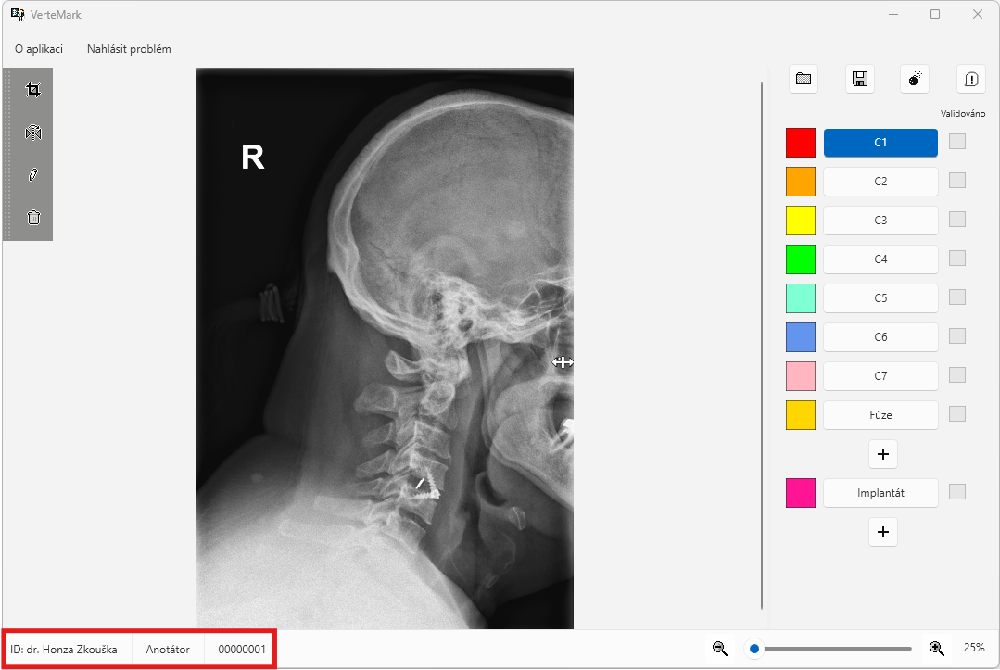

Vpravo v dolním rohu naleznete posuvnou lištu pro přiblížení.

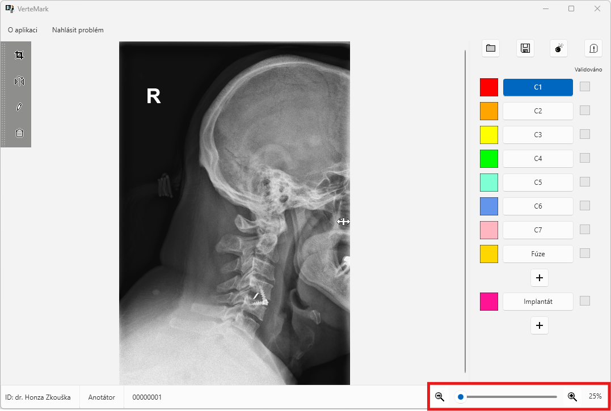

## Anotační část

Na pravo se nachází lišta pro anotaci obratlů.

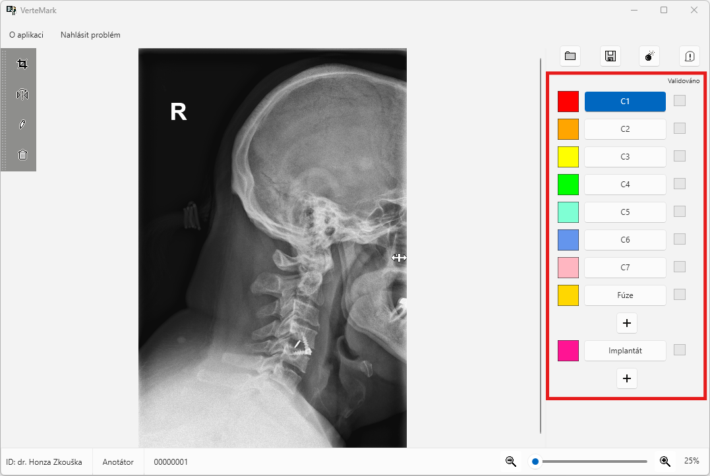

V případě, že se na snímku nachází více fúzí či implantatů lze anotací udělat více kliknutím na symbol `+`.

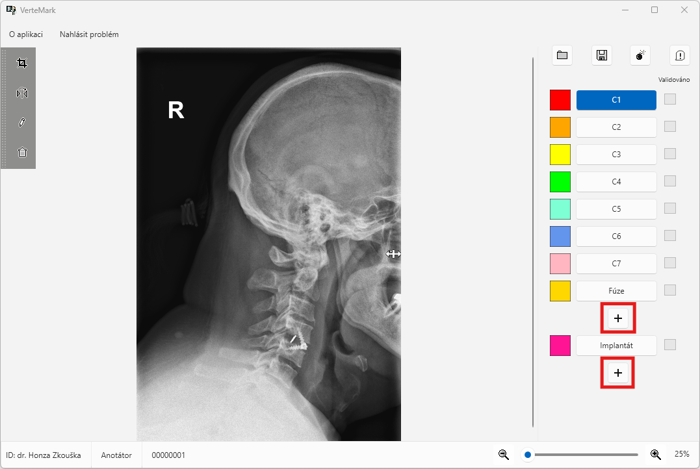

V případě, že jste v režimu **validátora** budete navíc moct manipulovat se zaškrtávacími políčky u obratlů. Tato políčka nemají žádný vliv na ukládání a zpracování snímků. Slouží pouze jako pomůcka pro průchod validátora kontrolovaným snímkem. Políčka jsou po otevření snímku vždy všechna zaškrtlá.

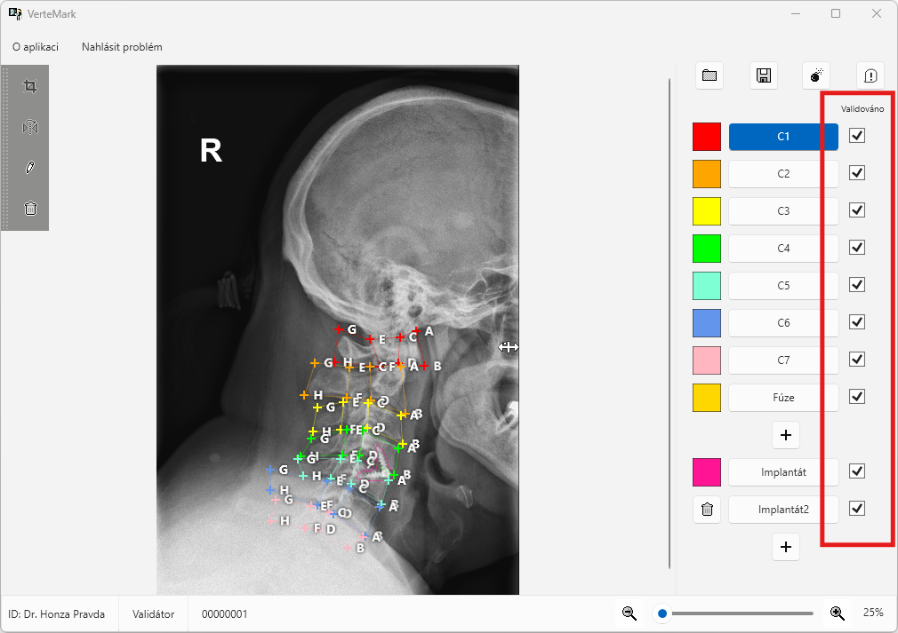

## Oříznutí, zrcadlení a smazání vybrané anotace

Vlevo v horním rohu se nachází panel pro **oříznutí** snímku, **zrcadlení** snímku, **přepnutí** zpět na anotaci a také **smazání** vybrané anotace.

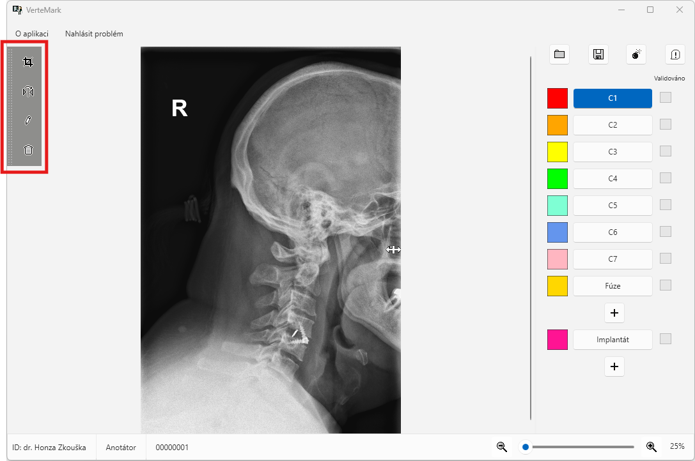

Oříznutí lze provést následovně.

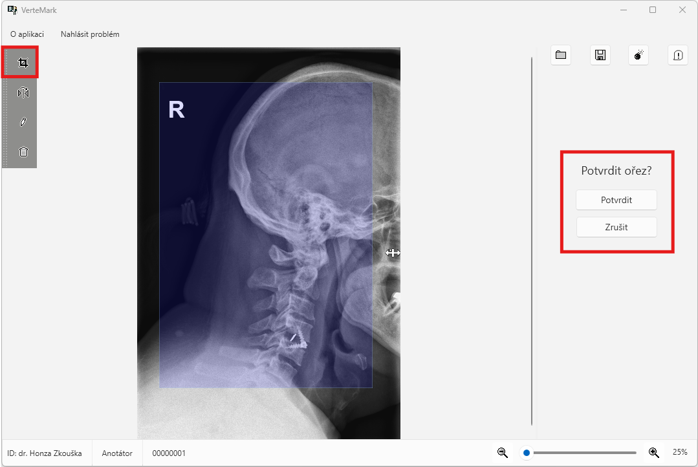

Pro smazání vybrané anotace klikněte vpravo v panelu obratlů na příslušný obratel (např. `C1`) a poté vlevo na ikonku `Smazat anotaci pro vybraný obratel...`.

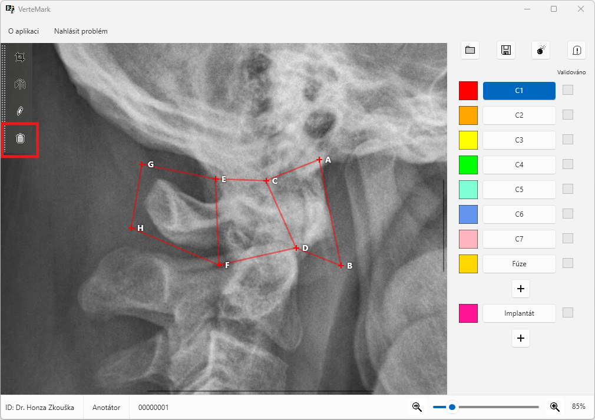

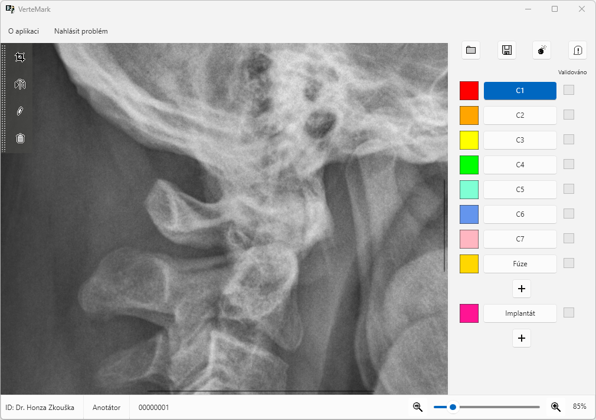

## Obnovit původní snímek a označit vadný snímek

Vpravo v horním rohu naleznete možnost pro obnovení původního snímku.

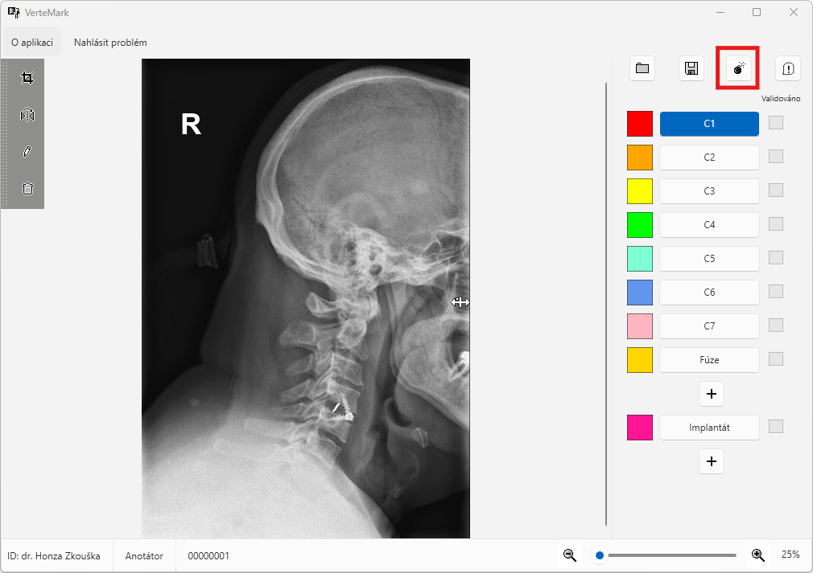

Před smazáním na vás vyskočí výzva o potvrzení, že opravdu chcete smazat veškeré úpravy na snímku.

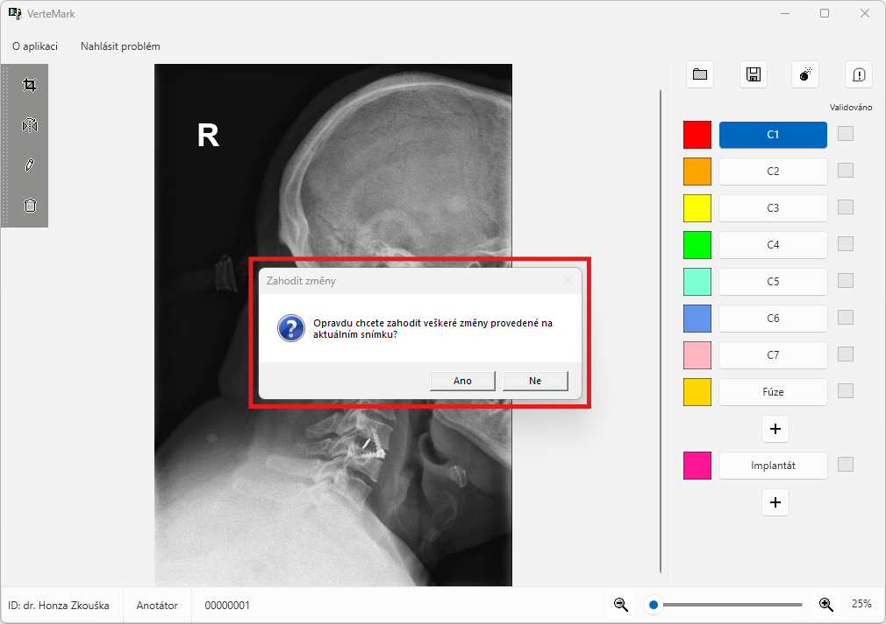

Dále naleznete možnost pro označení neplatného snímku.

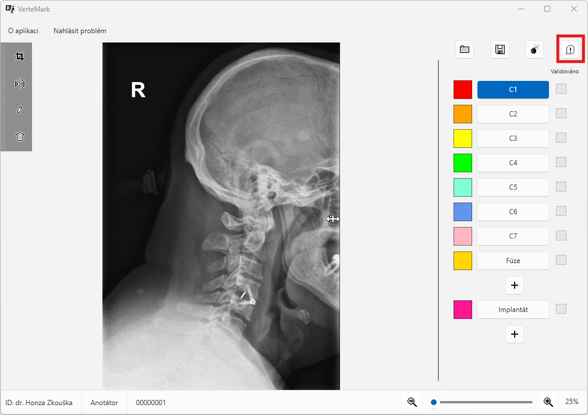

V případě, že takto snímek klasifikujete budete jej moct zpětně nalézt pod stejným názvem a to ve složce `Nevalidní snímky`.

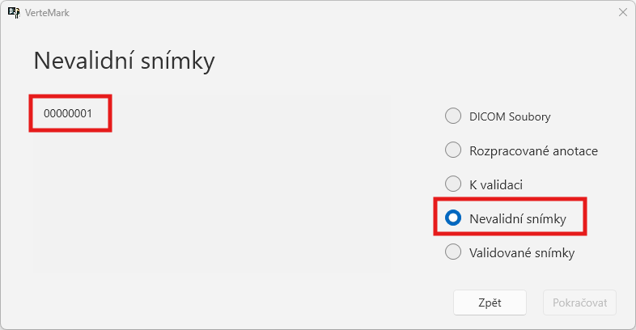

