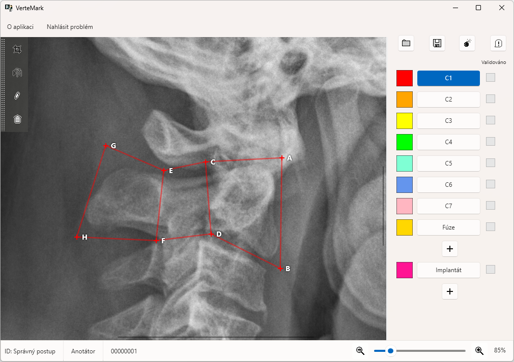
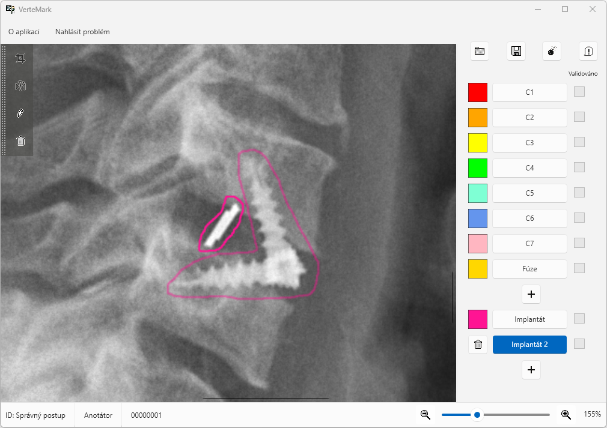

# Jak anotovat obratle a anomálie

## Obratle

Obratle se anotují celkem 8 body (A, B, C, D, E, F, G, H). Jejich rozmístění by mělo být následující:

$$
\begin{matrix}
G & E & C & A \\
H & F & D & B
\end{matrix}
$$

Tedy obratel by mohlo být anotován následovně:

## Anomálie

Implantáty lze anotovat jednoduchou spojitou křivkou.

> Při anotaci lze využít zkratku `CTRL+Z` která smaže poslední bod (v případě fúze/implantátu celou křivku).

