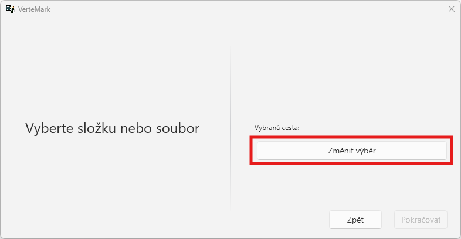
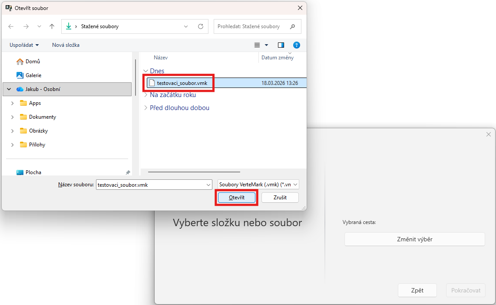
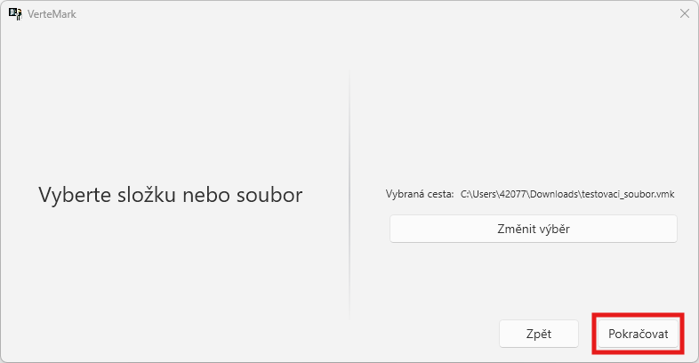
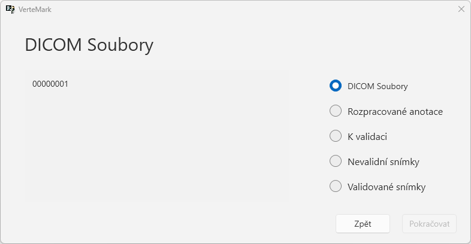

# Načtení souboru VMK

Po přihlášení na vás vyskočí okno, které vás požádá o vybrání složky nebo souboru.

Klikněte na `Změnit výběr`  

  
  
Najděte ve svém počítači umístění souboru typu `vmk`
> Poznáte tak, že název souboru končí jako `.vmk`

 

Klikněte na tlačítko `Pokračovat`  
 

Na další obrazovce uvidíte obsah VMK souboru (snímky)  

