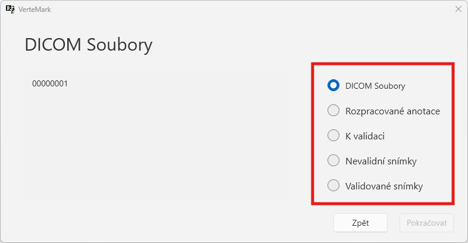
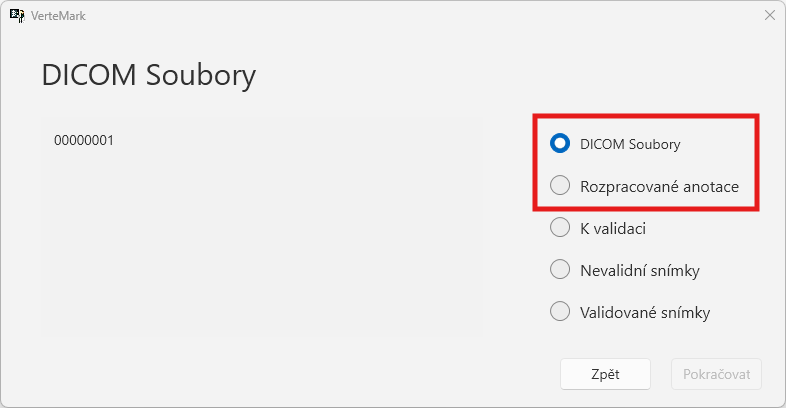
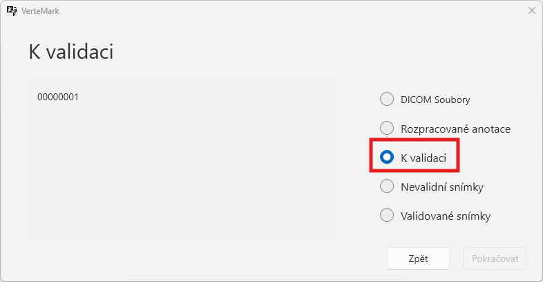
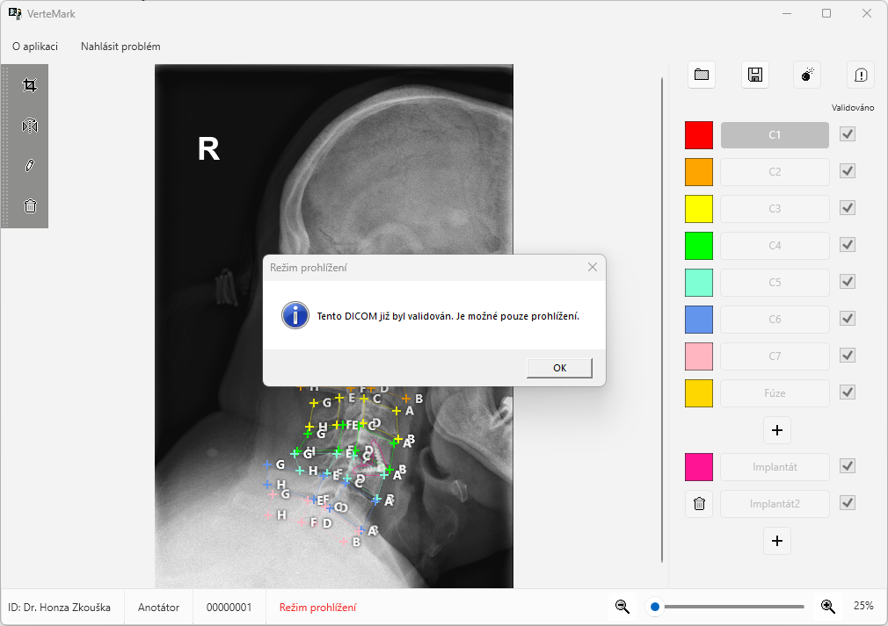
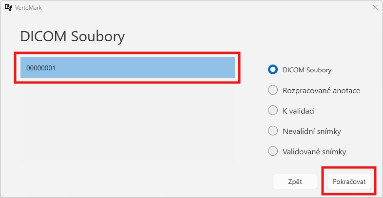
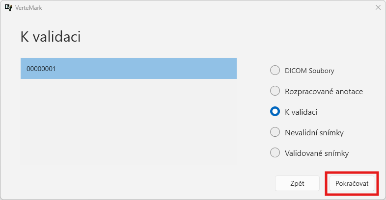

# Načtení souborů pro anotaci/validaci v DICOM menu

Po načtení VMK souboru uvidíte následující strukturu složek.  

Složkami se lze volně proklikávat z obou rolí.

## Role

### Anotátor

Jako **anotátora** vás zajímájí především složky `DICOM soubory` a `Rozpracované anotace`.

K souborům ve zbylých složkách má anotátor omezený přístup.

  

### Validátor

V případě, že jste **validátor** máte plný přístup ke všem složkám ve VMK souboru. 

Pokud chcete anotovat ještě neanotované snímky, pak využijete složky `DICOM soubory` a `Rozpracované anotace`.

Jestliže chcete plnit ryze validátorskou činnost, pak vás budou zajímat složky `K validaci`, `Nevalidní snímky`, `Validované snímky`.

## Otevření souboru

Pro načtení snímku v příslušné složce vyberte `název souboru` a klikněte na `Pokračovat`.

Nebo také například

