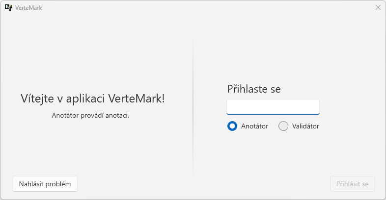
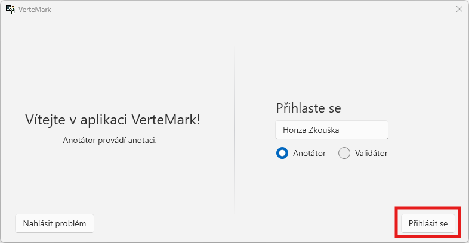

# Přihlášení

Pro přístup do aplikace VerteMark je vyžadováno zadat identifikační jméno a vybrat režim `anotátora` či `validátora`. 
> Jméno může obsahovat háčky, čárky i čísla.

Identifikační jména jsou vázaná k jednotlivým anotacím či validacím pouze z logovacího hlediska. Nejedná se tedy o účty, ke kterým jsou hesla. Výběr jména tedy nemá vliv na přístup k souborům, je zcela libovolný a může se opakovat.  
  
  
  
Zadejte identifikační jméno, vyberte režim a klikněte na `Přihlásit se`.  
  

