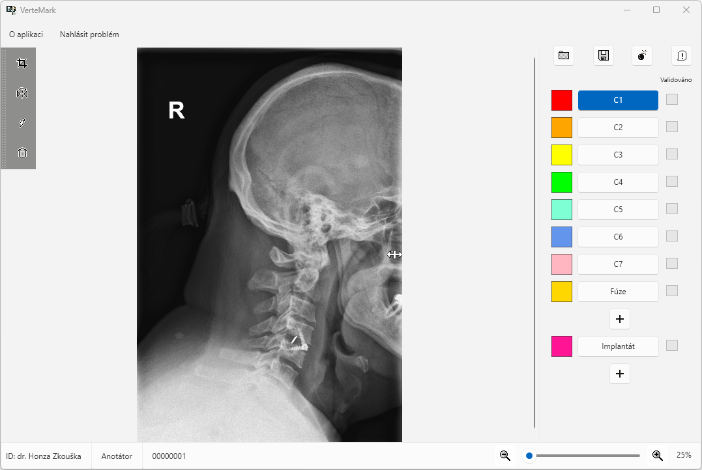
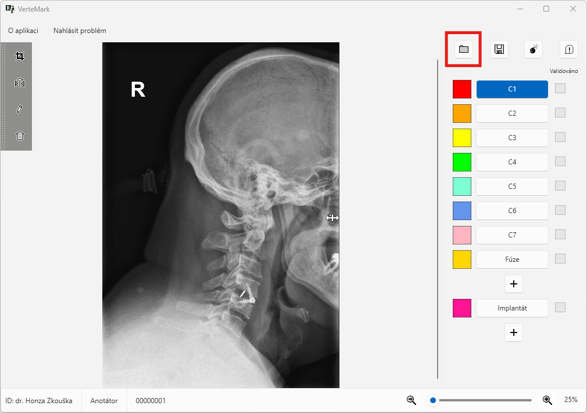
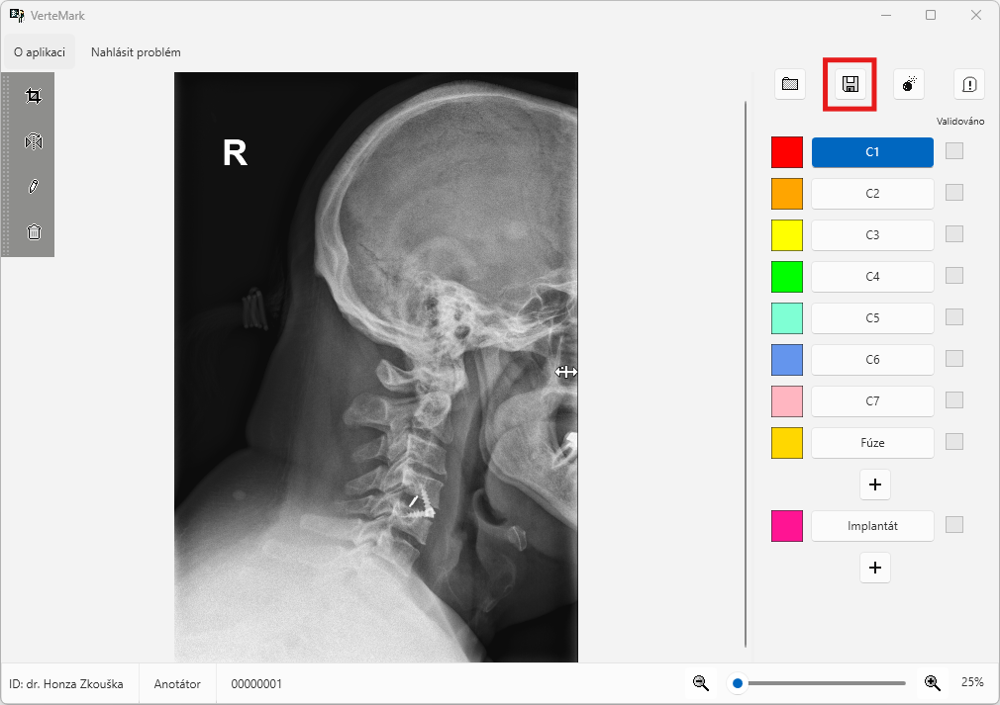
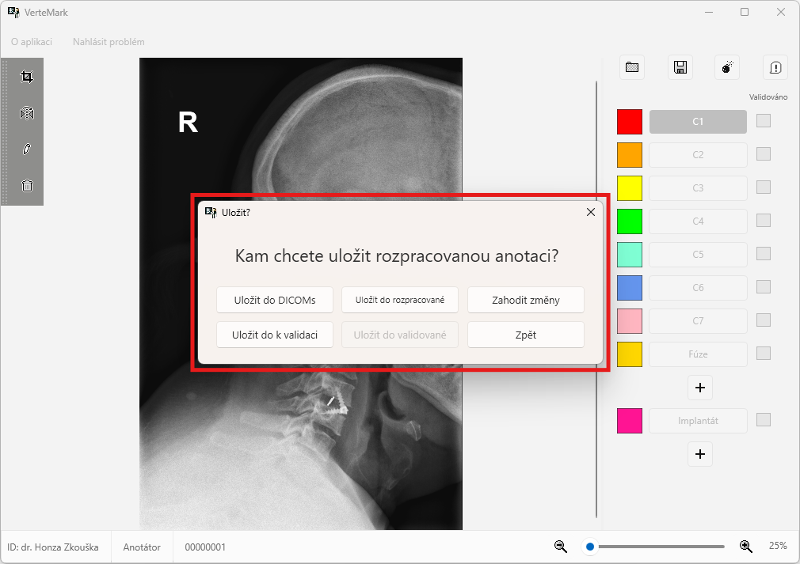
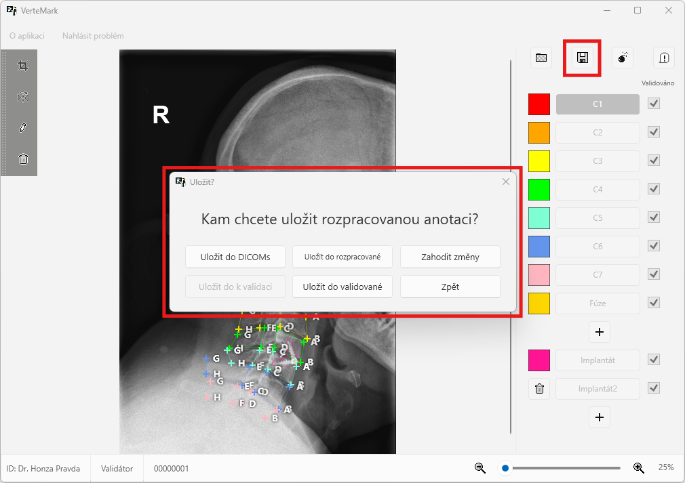
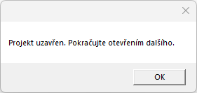

# Ukládání anotovaných snímků

Vpravo v horním rohu naleznete možnost pro otevření nového VMK souboru. Pokud jste soubor neuložili vyskočí na vás výzva pro uložení.

Další možnost je uložení snímku.

Pokud jste v roli **anotátora** pak snímky lze uložit do následujících složek

> Pozor! Snímky, které jsou uloženy do složek `K validaci`, `Nevalidní snímky` a `Validované snímky` má následně přístup pouze **validátor**.

Pokud jste v roli **validátora** pak snímky lze uložit do těchto složek:

  

V případě, že jste jako **validátor** uložil všechny snímky souboru VMK do složky `Validované snímky` vyskočí na vás následující okno a po kliknutí na možnost `OK` možnost vybrat nový VMK soubor.

  